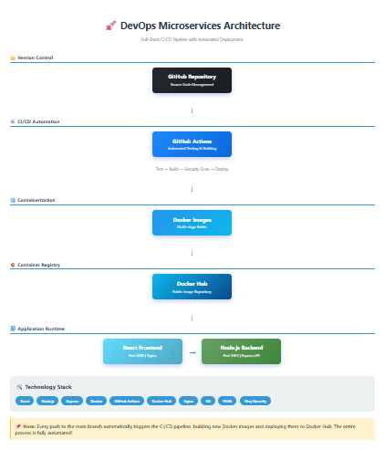
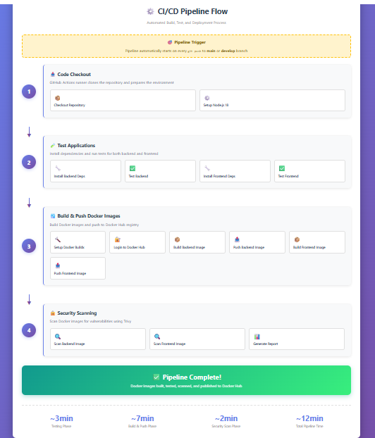

# DevOps Microservices Project

Full-stack microservices application demonstrating DevOps best practices.

## Architecture
- Backend: Node.js + Express API
- Frontend: React SPA
- Containerization: Docker
- Orchestration: Kubernetes

## Quick Start

### Run with Docker Compose
```bash
docker-compose up --build
```

### Access
- Frontend: http://localhost:3000
- Backend API: http://localhost:3001/health

### Run Without Docker

**Backend:**
```bash
cd backend
npm install
node server.js
```

**Frontend:**
```bash
cd frontend
npm install
npm start
```

## Architecture

### Application Architecture


### CI/CD Pipeline Flow


The architecture demonstrates:
- **Microservices Design**: Separate frontend and backend services
- **Containerization**: Docker multi-stage builds for optimization
- **Automated CI/CD**: GitHub Actions for continuous integration and deployment
- **Container Registry**: Docker Hub for image distribution
- **Security**: Automated vulnerability scanning with Trivy

## Project Structure
```
devops-microservices-project/
├── backend/              # Node.js API
├── frontend/             # React app
├── kubernetes/           # K8s manifests
├── terraform/            # Infrastructure as Code
└── docker-compose.yml    # Local development
```

## 📸 Screenshots

Key highlights:
- ✅ Automated GitHub Actions pipeline
- ✅ Docker images published to Docker Hub
- ✅ Running application (frontend + backend)
- ✅ Complete project structure

[View Screenshots →](./screenshots)

## Technologies
- Node.js, Express, React
- Docker, Kubernetes
- GitHub Actions
- Terraform
